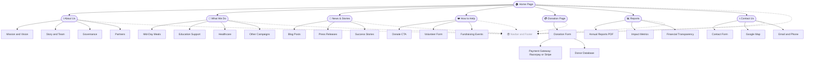

```mermaid
flowchart TD

%% === Main Navigation ===
home([🏠 Home Page]) --> about([ℹ️ About Us])
home --> programs([🍲 What We Do])
home --> news([📰 News & Stories])
home --> help([❤️ How to Help])
home --> donate([💳 Donation Page])
home --> reports([📊 Reports])
home --> contact([📞 Contact Us])

%% === About Us Subpages ===
about --> about_mission[Mission and Vision]
about --> about_story[Story and Team]
about --> about_govern[Governance]
about --> about_partners[Partners]

%% === Programs Subpages ===
programs --> prog_midday[Mid-Day Meals]
programs --> prog_edu[Education Support]
programs --> prog_health[Healthcare]
programs --> prog_other[Other Campaigns]

%% === News & Stories Subpages ===
news --> news_blog[Blog Posts]
news --> news_press[Press Releases]
news --> news_success[Success Stories]

%% === How to Help Subpages ===
help --> help_donate[Donate CTA]
help --> help_volunteer[Volunteer Form]
help --> help_events[Fundraising Events]

%% === Donation Flow ===
donate --> don_form[Donation Form]
don_form --> don_gateway[Payment Gateway: Razorpay or Stripe]
don_form --> don_db[Donor Database]

%% === Reports Subpages ===
reports --> rep_annual[Annual Reports PDF]
reports --> rep_metrics[Impact Metrics]
reports --> rep_finance[Financial Transparency]

%% === Contact Subpages ===
contact --> con_form[Contact Form]
contact --> con_map[Google Map]
contact --> con_info[Email and Phone]

%% === Global Nav Connection (dotted) ===
classDef ghost stroke-dasharray:5 5,opacity:0.7;
nav[🌍 Navbar and Footer]
home -.-> nav
about -.-> nav
programs -.-> nav
news -.-> nav
help -.-> nav
donate -.-> nav
reports -.-> nav
contact -.-> nav
class nav ghost
```
