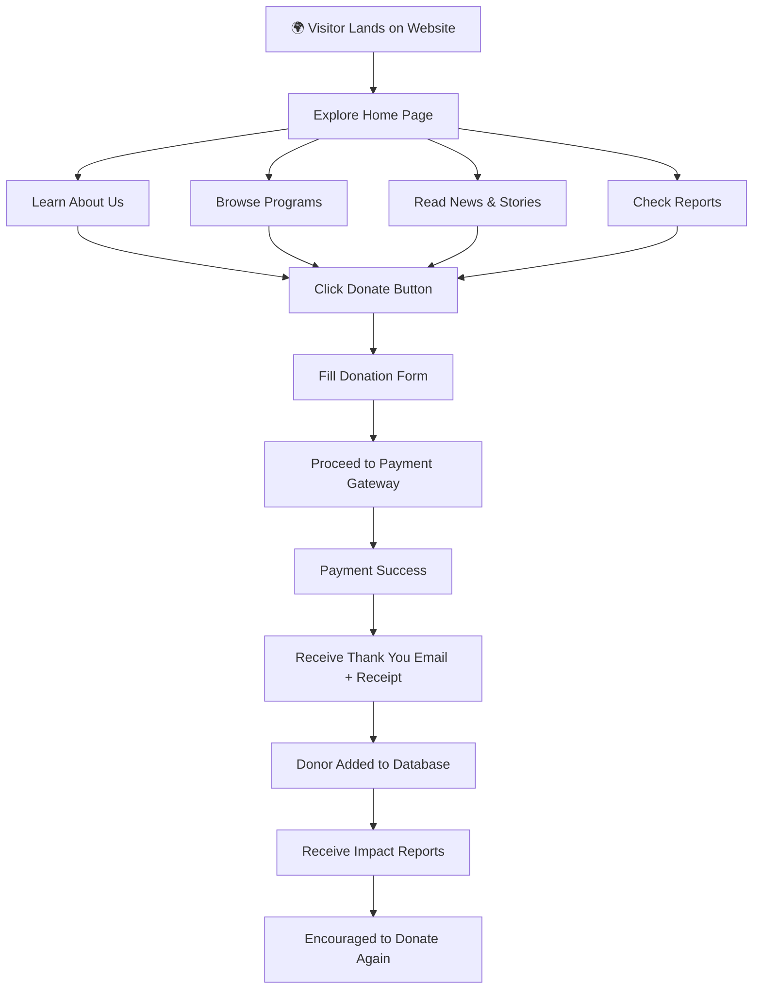

```mermaid
flowchart TD

%% === Entry Points ===
A[🌍 Visitor Lands on Website] --> B[Explore Home Page]

%% === Exploration ===
B --> C[Learn About Us]
B --> D[Browse Programs]
B --> E[Read News & Stories]
B --> F[Check Reports]

%% === Decision to Help ===
C --> G[Click Donate Button]
D --> G
E --> G
F --> G

%% === Donation Journey ===
G --> H[Fill Donation Form]
H --> I[Proceed to Payment Gateway]
I --> J[Payment Success]
J --> K[Receive Thank You Email + Receipt]

%% === Post-Donation Engagement ===
K --> L[Donor Added to Database]
L --> M[Receive Impact Reports]
M --> N[Encouraged to Donate Again]
```
